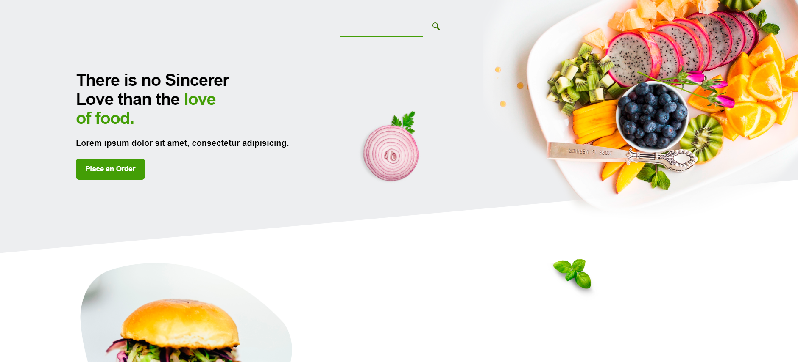
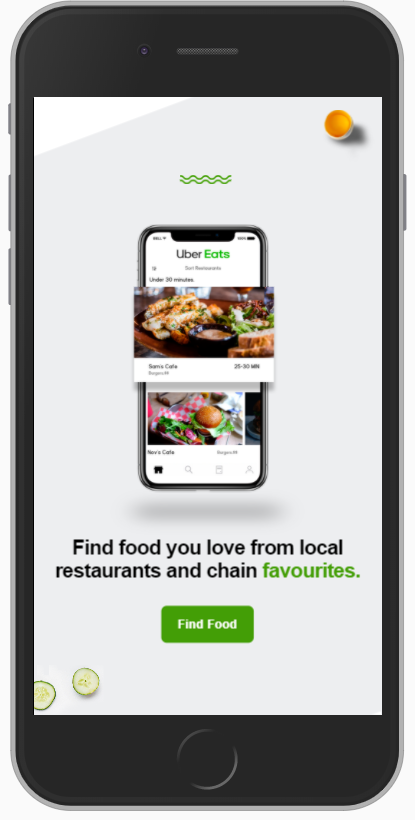

    <h1> Uber Eats layout <h1/>

---

---

    

---

# Table of Contents
- [About](#-about)
- [Technologies](#-technologies)

---

## 📝 About
The ***Uber Eats*** layout project was developed for a company challenge.

---
## 🚀 Technologies
The project was developed with the following technologies: 

- HTML
- CSS
- JavaScript

---

Made with 💙 by ***João Brosin***.